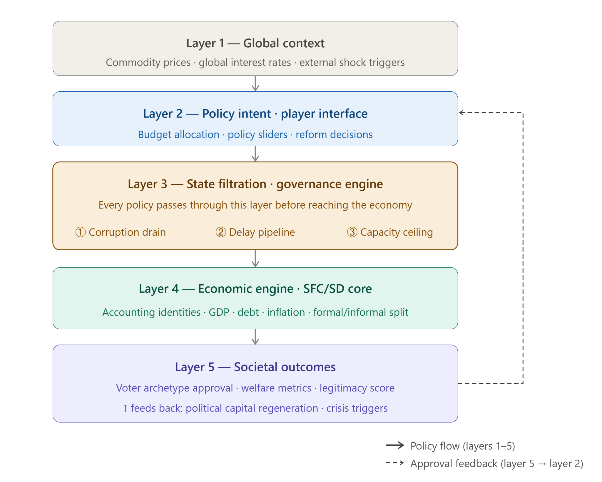
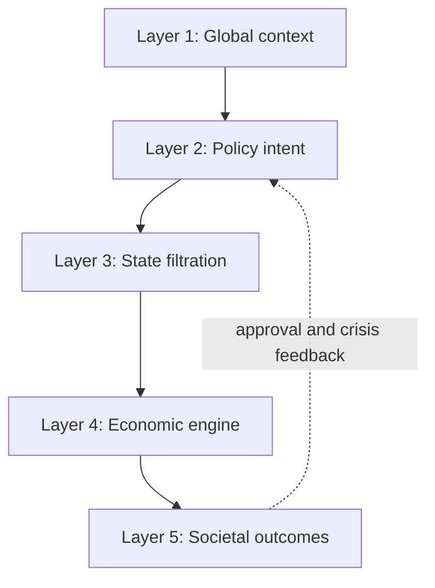
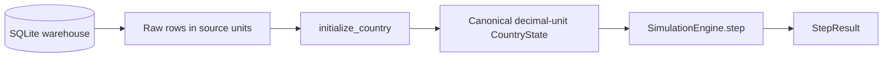
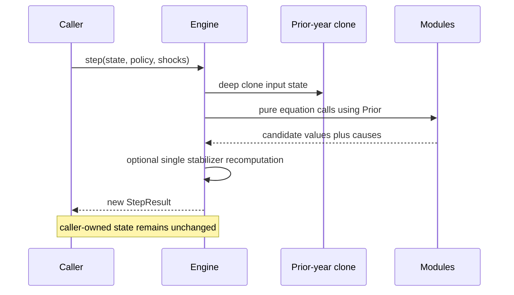

# POLITY Architecture

POLITY V1 is a deterministic annual state-transition system. Its architecture separates exogenous context, player policy, institutional filtration, macro-fiscal mechanics, and social outcomes while preserving one explicit update order from the implementation guidebook.

The authoritative specification is stored at [docs/specification/POLITY_ENGINE_V1_SPEC.md](docs/specification/POLITY_ENGINE_V1_SPEC.md). This document describes how that design is represented in the publication code.

## Five-layer model





### Layer 1: Global context

Code: `engine/global_context/shocks.py`

V1 exposes an `ExternalShocks` contract but does not generate randomness. Missing shocks normalize to zero. The implemented import-price change is passed into the hybrid NKPC through the trade-openness passthrough term. A caller can supply a deterministic shock sequence, but the release CLI uses the zero default.

This layer is intentionally narrow. Seeded random shocks, event generation, and broader commodity or interest-rate dynamics are V1.5 work.

### Layer 2: Policy intent and interface

Code:

- `engine/core/policy_inputs.py`
- `engine/policy/validation.py`
- `engine/policy/stabilizers.py`

`PolicyInputs` carries fiscal, expenditure-allocation, monetary-target, and trade-policy choices. Validation occurs before any annual equation is evaluated. The six expenditure shares divide total expenditure and must sum to 1.0. Ratios are decimal fractions throughout the engine.

The policy layer also applies two deterministic constraints at the end of a candidate annual pass:

- Sovereign pressure reduces effective expenditure when candidate debt exceeds the guidebook critical threshold.
- The unemployment safety net raises transfers to a minimum GDP share when unemployment exceeds 20 percent, taking funds from the largest eligible non-essential allocation by deterministic tie-breaking.

When a constraint changes the policy, the annual candidate is recomputed exactly once from the untouched prior-year snapshot. This gives the Step-23 policy override a real causal effect without introducing recursive or order-dependent behavior.

### Layer 3: State filtration and governance engine

Code:

- `engine/politics/stability.py`
- `engine/governance/capacity.py`

This layer represents the institutional transmission between player intent and economic execution.

Conflict risk is a calibrated logistic function of the youth structure, unemployment excess, urban-youth interaction, inequality, recession, inflation stress, legal capacity, and military spending. A country-specific intercept is fitted during initialization from the available WGI political-stability value.

The prior persisted conflict-risk band controls current-year capacity investment:

| Band | Risk | GDP penalty next year | Capacity investment |
|---|---:|---:|---|
| Stable | below 0.30 | none | full |
| Stressed | 0.30 to below 0.50 | -0.5 percentage points | half |
| Unstable | 0.50 to below 0.70 | -1.5 percentage points | blocked plus specified degradation |
| Crisis | 0.70 and above | -3 to -5 percentage points | blocked plus degradation |

Fiscal and legal capacity respond to administration spending, corruption, natural decay, and conflict. Corruption responds to legal suppression, conflict pressure, and poverty pressure.

### Layer 4: Economic engine

Code:

- `engine/economy/macro.py`
- `engine/economy/fiscal.py`
- `engine/trade/openness.py`

The economic layer implements the guidebook's annual closed-form equations:

- MRW-delta real GDP growth around country-specific potential growth.
- Physical-capital accumulation from infrastructure expenditure above depreciation.
- Human-capital contribution from the matured queue change.
- Legal-capacity TFP effect.
- Debt-overhang drag above the 60 percent threshold.
- Trade-openness delta effect conditional on the human-capital threshold.
- Prior conflict-risk GDP penalty.
- Potential-normalized, clamped output gap.
- Hybrid NKPC inflation with persistence, target anchoring, demand pressure, and import passthrough.
- Okun unemployment with a structural floor.
- Fiscal-capacity-limited revenue and expenditure flows.
- Intertemporal debt dynamics with nominal interest and nominal GDP growth.
- Piecewise nonlinear, autoregressive sovereign risk premium.
- Policy-target convergence for trade openness.

Each mechanism returns both its value and a named contribution breakdown. The orchestration layer does not reconstruct causes after the fact.

### Layer 5: Societal outcomes

Code:

- `engine/society/demographics.py`
- `engine/society/urbanization.py`
- `engine/society/human_capital.py`
- `engine/society/inequality.py`
- `engine/society/health.py`
- `engine/society/reference_metrics.py`

The social layer updates aggregate cohort shares and population, logistic urbanization, human capital, inequality, life expectancy, and display metrics.

The human-capital queue is a literal 15-position deque. Current education spending is converted into an investment entry, while the oldest entry matures into the workforce. The queue captures the temporal mechanism directly rather than approximating it with a single lag coefficient.

HDI and schooling-year outputs are Tier-3 reference metrics. They are calculated after the annual state update and are never read back by a subsequent model equation.

## State and result contracts

### CountryState: persistent Tier 1

`engine/core/country_state.py` contains values that persist between years:

- Economy: GDP, inflation, unemployment, debt/GDP, risk premium.
- Governance: fiscal capacity, legal capacity, corruption.
- Demographics: population and youth, working-age, elderly, and urban shares.
- Society: human capital, life expectancy, Gini, trade openness.
- Internal timing: human-capital queue, prior conflict risk, and prior GDP growth.
- Calibration constants: potential growth, structural unemployment, urbanization capacity, and conflict intercept.

The guidebook's declared dataclass omits `conflict_risk` even though later equations require the previous year's value. The implementation persists it explicitly. `previous_gdp_growth` is also retained narrowly because urbanization requires the previous annual growth rate. Both reconciliations are documented in [IMPLEMENTATION_REPORT.md](IMPLEMENTATION_REPORT.md).

`CountryState.clone()` creates a deep copy, including an independent deque. Range validation is centralized on the state contract.

### PolicyInputs: annual intent

`engine/core/policy_inputs.py` is immutable. `with_updates()` returns a new policy object for scenario construction. Validation is separate so data construction, CLI parsing, and model execution have a clear boundary.

### StepResult: one completed annual transition

`engine/core/step_result.py` contains:

- `state`: the new persistent state.
- `derived`: Tier-2 values computed for that year.
- `reference`: Tier-3 display metrics.
- `audit_log`: every state and derived change with named causes.

### AuditEntry: causal record

`engine/core/audit_entry.py` records:

- source year;
- variable name;
- new value;
- change from the previous value;
- ordered `(cause, magnitude)` pairs;
- severity classification;
- a plain-language note.

The audit log includes entries with severity `none`. Interfaces can suppress them, but the simulation result retains the full explainability record.

## Data boundary and initialization



Code:

- `engine/data/country_loader.py`
- `engine/core/initialize_country.py`

The loader returns raw warehouse values and does not construct model semantics. Initialization performs the one-time boundary conversion:

- percentages become decimal ratios;
- WGI values become normalized capacities;
- CPI-style corruption values become a 0-to-1 corruption measure where 1 is maximally corrupt;
- revenue/GDP becomes fiscal capacity;
- schooling values become the education index;
- debt initializes the risk premium;
- historical GDP and inflation form a real-growth proxy for potential growth;
- the lowest historical unemployment initializes the structural floor;
- the historical stability score calibrates the conflict intercept;
- unavailable education-spending history uses the guidebook's 4 percent fallback for the queue.

When a baseline field is null, the initializer asks for the nearest non-null observation for the same country. Equal-distance ties prefer the earlier year to reduce future leakage. If no required historical value exists, initialization fails explicitly.

## Exact annual update sequence

The orchestrator is `engine/core/simulation_engine.py`. One call follows this sequence:

1. Validate requested policy inputs.
2. Update demographic shares and population.
3. Update urbanization from prior GDP growth.
4. Advance the human-capital queue.
5. Compute raw MRW-delta GDP growth.
6. Apply the prior conflict-risk GDP penalty.
7. Update absolute GDP.
8. Compute the output gap.
9. Update inflation.
10. Update unemployment.
11. Compute fiscal flows and expenditure amounts.
12. Update debt/GDP.
13. Update the sovereign risk premium.
14. Update the Gini coefficient.
15. Update life expectancy.
16. Evaluate current conflict risk.
17. Update fiscal and legal capacity using the prior conflict band.
18. Update corruption.
19. Commit trade openness.
20. Compute school-life expectancy.
21. Compute Tier-3 reference metrics.
22. Build the complete audit log.
23. Evaluate automatic stabilizers and, when necessary, recompute once with the effective policy.
24. Increment the year and return `StepResult`.

The implementation calculates the Step-19 trade value prospectively before GDP growth because the guidebook's GDP equation requires the trade delta at Step 5. It does not commit that state value until Step 19.

## Prior-year snapshot rule

Every domain equation receives values from the same deep prior-year snapshot plus local candidate flow values that the guidebook explicitly requires. No equation reads a partially mutated `CountryState`.



This rule prevents hidden same-year feedback, makes order visible, and supports exact deterministic replay.

## Deterministic execution

V1 determinism follows from five constraints:

1. No stochastic generator is called.
2. External shocks are explicit inputs with a zero default.
3. Input dataclasses and deque state are cloned before computation.
4. Stabilizer allocation and recomputation use deterministic ordering and a fixed maximum of one recomputation.
5. Result serialization has stable dictionary keys and ordered audit causes.

The release verification simulates Kenya for 20 years twice, compares complete serialized states, derived values, reference values, and audit entries, and verifies that the initial input state remains unchanged.

Determinism does not mean scientific validity. It means replayability under identical inputs.

## Module dependency direction

The intended dependency direction is:

```text
core contracts and constants
        |
        +--> pure policy, governance, politics, economy, society, trade modules
        |
        `--> simulation_engine orchestrates those modules

loader --> initializer --> CountryState --> simulation_engine --> StepResult
CLI ----------------------------------------------------------^ 
```

Domain modules do not import the CLI. Tier-3 reference metrics do not feed state equations. Data-download and ETL tools do not participate in annual execution.

## Automatic stabilizer architecture

The guidebook places stabilizers after the candidate annual result. A literal policy change at that point would otherwise have no effect on the returned year. POLITY resolves this by:

1. computing one ordinary candidate from the prior snapshot;
2. evaluating debt and unemployment constraints;
3. constructing a new effective policy when a constraint fires;
4. recomputing the same annual path exactly once from the original prior snapshot;
5. adding stabilizer causes to the returned audit record.

There is no repeated convergence loop. The approach is deterministic, preserves the requested annual ordering, and makes the override observable.

## Security and publication boundaries

The repository contains only aggregate research data and source needed for the release. Raw third-party downloads, local metadata, caches, backups, runtime outputs, editor state, and credentials are excluded. Both the working tree and Git history are scanned by `scripts/security_scan.py` during release preparation.

The bundled database appears twice so both a source checkout and a packaged install can run immediately. `tools.validation.check_database_sync` requires both copies to remain byte-identical.

## Deferred architecture

The following are intentionally absent from V1 and should not be inferred from placeholder packages:

- stochastic shock generation;
- narrative events and player choices;
- dynamic potential growth and country-fitted macro coefficients;
- full cohort-component demographics;
- regime-type policy constraints;
- bilateral and multi-country trade;
- resource-rent and Dutch-disease dynamics;
- explicit civil-conflict state transitions;
- financial-sector and credit-cycle dynamics;
- environmental productivity drag.

Adding a deferred mechanism requires a versioned specification change, isolated modules, deterministic tests, audit causes, and documentation of any new state variables.
